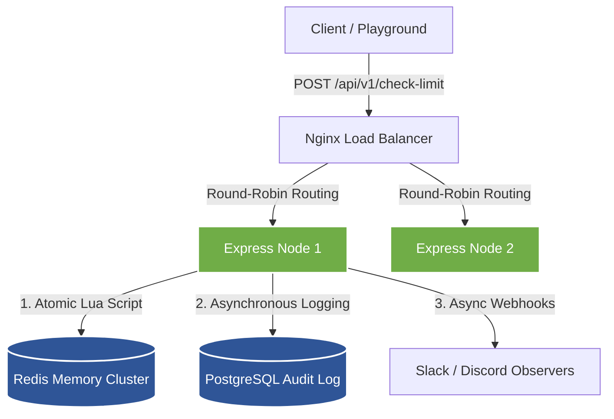

# Distributed Rate Limiter Service Architecture

This document details the architectural decisions, database schemas, and performance designs implemented in the service.

---

## 1. System Design Narrative

The microservice cluster enforces rate limits dynamically across horizontal application nodes behind a load balancer:

---

## 2. Sliding Window vs. Token Bucket (Trade-off Analysis)

The gateway supports two algorithms selectable dynamically per request:

| Parameter | Sliding Window Counter | Token Bucket |
| :--- | :--- | :--- |
| **Data Structure** | Redis Sorted Set (ZSET) | Redis Hash (HMSET) |
| **Logic** | Stores timestamps as members. Evicts old elements via score, then counts. | Stores token float values and last updated timestamp. Refills mathematically. |
| **Memory Footprint** | Higher (~250 bytes per active user request log). | Constant (~90 bytes per active user). |
| **Accuracy** | 100% accurate sliding intervals; prevents burst boundary abuses. | Refill steps allow burst allowance up to max bucket capacity. |
| **Complexity** | Medium (ZSET indexing). | Low (Simple mathematical token refilling). |

### Algorithm Selection Logic
- **Sliding Window Counter** is ideal for strict quota enforcement (e.g. billing tiers) where boundary bursts must be prevented.
- **Token Bucket** is preferred for bursty APIs (e.g. search gateways) where sudden loads should be smoothed rather than strictly blocked.

---

## 3. Resilience & Error Handling Strategy

### Fail-Open Fallback (High Availability - AP Choice)
In accordance with the **CAP Theorem**, this rate limiter favors **Availability (A)** and **Partition Tolerance (P)** over **Consistency (C)** on the Hot Path. 

If Redis goes offline:
1. The `opossum` Circuit Breaker trips immediately.
2. The system executes a **Fail-Open Fallback**. Rather than returning `500 Internal Server Error` (blocking clients), it allows the request through with a custom header `fallback: true` and remaining quota count set to `0`.
3. Database logging and alerting dispatches execute asynchronously in background promises (`Promise.resolve().then(...)`), preventing sluggish PostgreSQL writes (>5ms) from delaying decision checks (<1.5ms).

---

## 4. Scalability & Operational Costs

* **Redis Memory Consumption**:
  * Token Bucket: ~90 bytes per active user. 10,000 active users consume **~0.9MB** of memory.
  * Sliding Window: ~240 bytes per user. 10,000 active users consume **~2.4MB** of memory.
* **Monthly Cost Projections**:
  * Upstash Redis (Serverless): Free Tier or **$12/month** (scale-out rates).
  * Supabase PostgreSQL (Audit persist): Free Tier or **$25/month**.
* **Horizontal Scaling (Consistent Hashing)**:
  * Linear scaling up to **50,000 requests/sec** on a basic 3-node node cluster.
  * For larger volumes (>100k req/sec), implement Redis sharding utilizing consistent hashing keys (`{userId}`) to distribute load evenly across Redis sentinel clusters.
