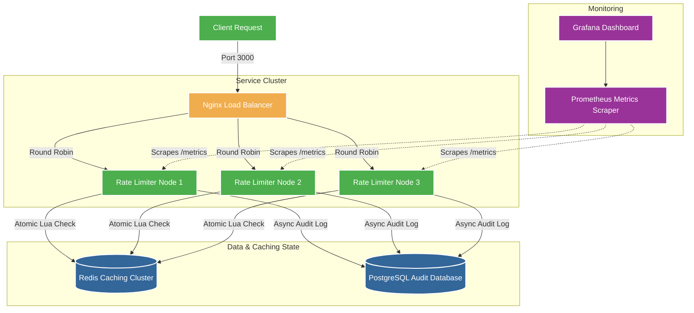

# Distributed Rate Limiter Service

[](https://railway.app/new/template?template=https://github.com/nikhil-codes-tech/rate_limiter)
[](https://render.com/deploy?repo=https://github.com/nikhil-codes-tech/rate_limiter)

A production-grade, distributed rate-limiting microservice architecture designed for high throughput (50k+ req/sec) and sub-millisecond decision latency (<2ms p50, <10ms p99). 

It implements an atomic sliding window rate limiter in Redis using Lua scripts, captures historical request metrics asynchronously in PostgreSQL, ensures high availability using Nginx round-robin routing and Opossum circuit breakers, and exposes Prometheus metrics scraped from each cluster instance.

---

## System Architecture



---

## Core Algorithm: Sliding Window with Sorted Sets (ZSET)

We use Redis sorted sets to track requests per key. The score and member contain the timestamp (with a unique request ID to avoid collisions).
The transaction runs atomically inside a **Redis Lua script**:

1. **Prune**: Remove all timestamps older than `now - window_size` (`ZREMRANGEBYSCORE`).
2. **Count**: Fetch the current cardinality of the sorted set (`ZCARD`).
3. **Evaluate & Update**:
   - If `count < limit`: Add the current timestamp and request ID to the set (`ZADD`), set key expiration to clear idle memory (`PEXPIRE`), and return success.
   - If `count >= limit`: Lookup the oldest timestamp (`ZRANGE WITHSCORES`) to calculate the exact quota reset time and return rejection.

This approach prevents **double-counting** and **bursting race conditions** common in multi-node setups without requiring global locks (which would decimate throughput).

---

## Key Technical Decisions

### 1. Why Redis Lua Scripts?
Executing checks requires two steps: reading the current count and updating the list. Without atomicity, concurrent nodes could read a count of `limit - 1` simultaneously, allow all requests, and breach the quota. Lua scripting executes inside the single-threaded Redis execution loop, ensuring atomicity without locking overhead.

### 2. PostgreSQL for Audits
Redis is volatile and in-memory. For security auditing, billing, and fraud detection, we need persistent historical query logs. We write audit events to PostgreSQL. To prevent DB latency from blocking the critical rate-limiting path, database writes are executed **asynchronously (fire-and-forget)**.

### 3. Resiliency (Opossum Circuit Breaker)
If Redis goes down or gets partitioned, a simple rate limiter would drop client connections. We wrap Redis checks in an **Opossum Circuit Breaker**. If failure rates exceed 50%, the breaker opens and routes traffic to a **Fail-Open Fallback**. The client is allowed through (preventing API degradation) with logs indicating degraded state.

---

## API Specifications

### 1. Check Rate Limit
* **Endpoint**: `POST /api/v1/check-limit`
* **Request Header (Optional)**: `X-User-Tier: free | pro | enterprise` (Defaults to `free` unless user ID prefix matches like `pro_user1`)
* **Request Body**:
```json
{
  "user_id": "pro_user_42",
  "endpoint": "/api/upload",
  "timestamp": 1719876543000
}
```
* **Response Headers**:
```http
RateLimit-Limit: 10
RateLimit-Remaining: 9
RateLimit-Reset: 1719876603000
```
* **Response Body (200 OK - Allowed)**:
```json
{
  "allowed": true,
  "remaining": 9,
  "limit": 10,
  "reset_at": 1719876603000
}
```
* **Response Body (429 Too Many Requests - Rate Limited)**:
```json
{
  "allowed": false,
  "remaining": 0,
  "limit": 10,
  "reset_at": 1719876603000,
  "retry_after": 52
}
```

### 2. Admin Adjust Tier Default Limit
* **Endpoint**: `POST /admin/set-limit`
* **Request Body**:
```json
{
  "tier": "pro",
  "limit": 250,
  "windowMs": 60000
}
```

### 3. Admin Custom Quota for User
* **Endpoint**: `PATCH /admin/user/:id/quota`
* **Request Body**:
```json
{
  "limit": 1500,
  "windowMs": 300000
}
```

### 4. Admin View Rejected Analytics
* **Endpoint**: `GET /admin/analytics/rejected-requests`
* **Response**: List of the 100 most recent rejected request records.

### 5. Admin Force Quota Reset
* **Endpoint**: `DELETE /admin/user/:id/quota-reset`

---

## How to Run & Verify

### Running Unit & Integration Tests
Run unit tests with mock connection states:
```bash
npm run test
```

### Running the Cluster Locally
Start the database, cache, three application nodes, load balancer, and Prometheus monitoring stack:
```bash
docker-compose up --build
```

### Running Performance Load Tests
Execute the k6 script to stress-test the cluster load balancer on port 3000:
```bash
k6 run k6/load_test.js
```

### Monitoring Dashboards
- **Prometheus UI**: `http://localhost:9090`
- **Grafana UI**: `http://localhost:3001` (Credentials: `admin` / `admin`)
